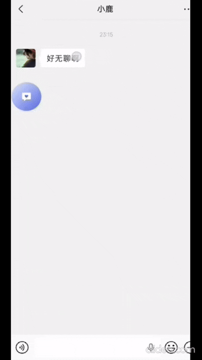
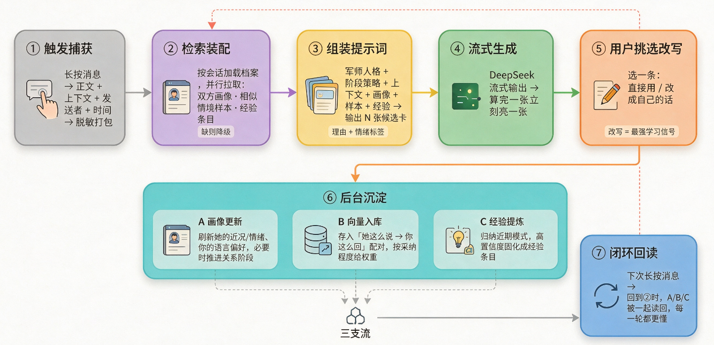

<div align="center">

# LoveBrain

Android 悬浮窗聊天助手，帮你在亲密关系对话里想出下一句。



</div>

## 它能做什么

长按对方发来的消息（或手动粘贴），一次生成**最多 8 条**可直接发送的回复建议：

- **4 种风格**：推荐 / 清醒 / 俏皮 / 温柔
- **4 种方向**：跟进 / 展开 / 表达 / 转向

你挑一条最像自己说话方式的，改改语气再发。军师只递词，不替你开口。

它同时会维护一份**本地关系记忆**：五维向量、阶段追踪、经验沉淀，越用越贴合你们的相处方式。

## 工作原理



## 环境要求

- Android 8.0（API 26）及以上
- 自备 AI 服务商的 API key

## 安装

从 [Releases](https://github.com/bystery/LoveBrain/releases) 下载最新的 `app-release.apk` 安装。需要授予悬浮窗权限；无障碍权限可选，仅用于长按自动捕获消息内容，不开启的话手动复制粘贴也能用。

## 配置 AI 服务商

打开 App，选择 DeepSeek 或其他 OpenAI 兼容服务商，填入 baseUrl、model 和 API key。key 加密存储在本地（Android Keystore）。

## 性能实测

> ⚠️ 下表是 **2026-09-03 的一次运行读数**（deepseek-v4-flash，非高峰期，19 个场景 50 道题串行）。
> 复现脚本、依赖锁与原始 JSON/CSV 尚未补齐，因此这些数字目前**不可原样复现**，只作量级参考。
> 详见 [BENCHMARK.md](BENCHMARK.md)。

| 指标 | 数值 |
|---|---|
| 首字延迟 | 527 ms |
| 缓存命中率 | 83% |
| 50 题总花费 | ¥0.17 |

## 从源码构建

```bash
git clone https://github.com/bystery/LoveBrain.git
cd LoveBrain
./gradlew assembleDebug
```

产物在 `app/build/outputs/apk/debug/`。Windows 上项目路径请只用 ASCII 字符，否则构建工具链会报错。

## 隐私

- 没有 LoveBrain 后端，无遥测、无统计、无广告 SDK。
- 聊天记录上下文、知识库、画像等全部是 App 私有目录里的本地文件。
- 唯一的网络出口是用户自己配置的 AI 服务商请求。
- 已关闭云备份（`allowBackup=false`）。
- 知识库导出是明文 zip，分享前请自行检查内容。

## 许可

AGPL-3.0 或商业许可，见 [LICENSE](LICENSE)。闭源商用需获得维护者许可。

个人项目。欢迎提 pull request，但没有支持 SLA。
